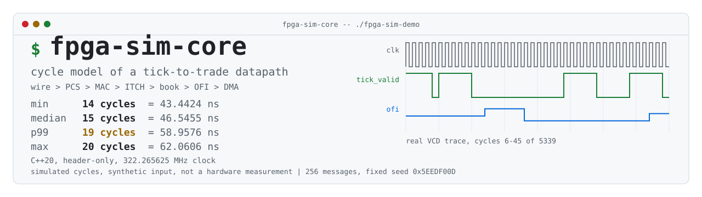
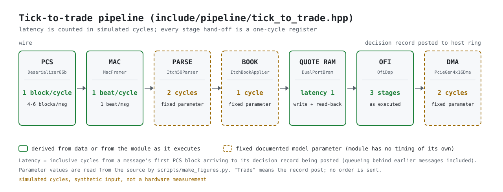
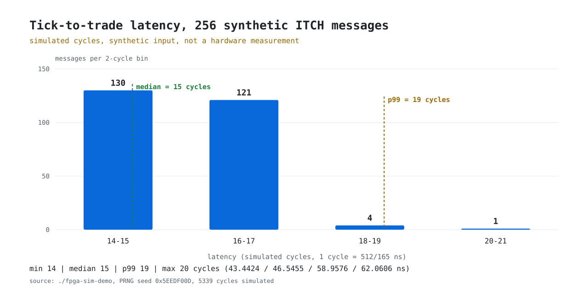
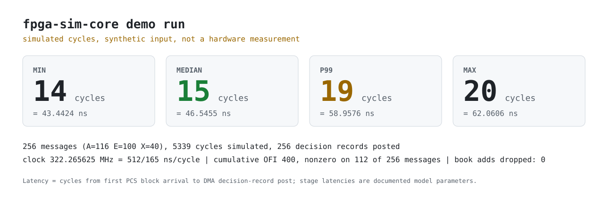
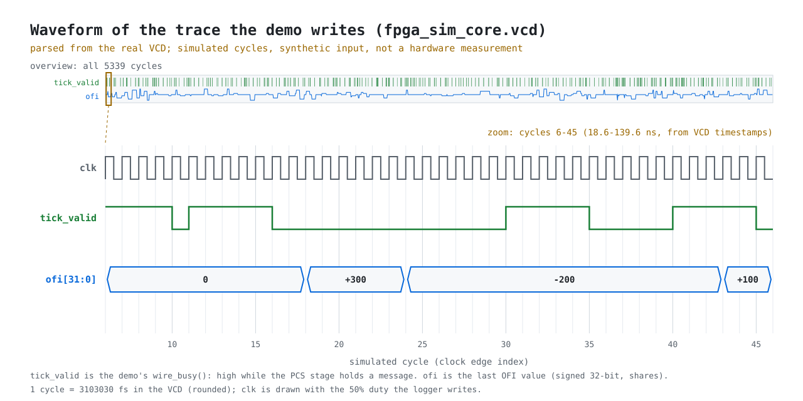

# fpga-sim-core

<picture>
  <source media="(prefers-color-scheme: dark)" srcset="docs/img/hero-dark.svg">
  
</picture>

A deterministic C++20 cycle model of a tick-to-trade datapath (wire, PCS,
MAC framing, ITCH parse, order book, order-flow imbalance, DMA), clocked at
322.265625 MHz. One cycle is 1 / 322.265625 MHz = 512/165 ns = 3.10303... ns.
The point is to single-step a clock domain and print intermediate state, which
real hardware does not let you do. There is no `std::chrono` anywhere in the
model, only the engine's cycle counter.

**What the numbers are and are not.** The demo drives a *synthetic* ITCH 5.0
stream through the actual modules under the engine's cycle counter and reports
per-message latency **in simulated cycles**. That is a property of a model of
a pipeline whose stage latencies are documented parameters (table below). It is
not a hardware measurement, not market data, and not a claim about the latency
of any real FPGA or NIC.

The scheduler (`core/discrete_engine.hpp`) keeps posedge/negedge callbacks in
a fixed `std::array<Slot, 16>`, not a `std::vector` or `std::function`, so
registering a clock edge costs no heap allocation and no virtual dispatch; the
callback type is a bare `void(*)(void*, uint64_t) noexcept` function pointer.
Registration is bounds-checked: `on_posedge`/`on_negedge` return `false` once
the 16 slots are full. The clock period is derived in one place
(`DiscreteEngine::clock_hz`); nanosecond reports use exact integer arithmetic
(`cycles_to_ns_e4`), no floating point. No-allocation is by construction (no
`new`/`malloc`/`std::vector` in `include/`) and is checked by
`test-hot-path-alloc` on the paths listed in "Allocation audit" below. Timing
claims beyond that (e.g. "no allocator jitter under `-O2`") are not measured.

The datapath models:

- PCS block-lock and CRC32 validation primitives, in a block shape inspired
  by 64b/66b (`Deserializer66b`) but without its scrambler or control-block
  sync header; see the doc comment on that class before assuming 802.3
  conformance.
- AXI4-Stream 512-bit framing with IPG verification.
- Zero-copy big-endian NASDAQ ITCH 5.0 parsing for `A`, `E`, and `X`
  (byte-wise field reads: no alignment requirement, no type punning), plus the
  inverse `Itch50Encoder` used by the synthetic stream and the round-trip tests.
- A generic synchronous dual-port BRAM model (`DualPortBram<T, Depth, Latency>`)
  with same-cycle collision assertions, and a separate five-level order book
  (`FiveLevelOrderBook`) that counts adds dropped when a side is full and
  reports best bid/ask. An `OrderTable` maps order references to side/price;
  `ItchBookApplier` applies decoded events to the two (see "Malformed input
  and book semantics" below).
- A three-stage signed 32-bit OFI pipeline (Cont-Kukanov-Stoikov event OFI) and
  a compile-time micro-price LUT.
- Preallocated 64-byte-aligned host rings and a PCIe Gen4 x16 TLP/MSI-X model.
- Minimal IEEE 1364 VCD output suitable for GTKWave (1 fs timescale; a cycle
  is rounded to 3103030 fs, about 1e-7 relative error in trace timestamps).

## Build

```sh
cmake -S . -B /tmp/fpga-build -DCMAKE_BUILD_TYPE=Release
cmake --build /tmp/fpga-build --parallel
ctest --test-dir /tmp/fpga-build --output-on-failure
(cd /tmp/fpga-build && ./fpga-sim-demo)   # also writes fpga_sim_core.vcd in the cwd
```

## The measured-in-simulated-cycles pipeline

`include/pipeline/tick_to_trade.hpp` runs each message of a synthetic ITCH
stream (`include/pipeline/synthetic_itch.hpp`: 256 `A`/`E`/`X` messages at the
real byte layouts, fixed-seed xorshift32, so identical on every run and
platform) through the real module code, one cycle at a time. Latency for a
message is the inclusive number of cycles from the cycle its first PCS block
reaches the receiver (its scheduled arrival, so queueing behind earlier
messages is included) to the cycle a decision record is posted to the DMA
ring. "Trade" here means that decision-record post; no order is sent.

Where each stage's cycles come from:

| Stage | Cycles | Source |
| --- | --- | --- |
| PCS | 1 block/cycle; blocks = ceil((len+4)/7) (4-6 here) | derived from the real `encode()` output; `decode()` checks CRC |
| MAC | 1 beat/cycle; beats = ceil(len/64) (1 here) | derived; each beat goes through `MacFramer::accept()`; IPG assumed 12 idle bytes |
| Parse | 2 | **fixed documented parameter** (`PipelineParams::parser_cycles`); the parser has no timing of its own |
| Book | 1 | **fixed documented parameter** (`book_cycles`); `ItchBookApplier` has no timing of its own |
| Quote RAM write + read-back | from `DualPortBram` `Latency` = 1 | derived from the BRAM model as it executes |
| OFI | 3 stages (`OfiDsp::pipeline_stages`) | derived from the OFI model as it executes |
| DMA post | 2 | **fixed documented parameter** (`dma_post_cycles`); the DMA model has no timing of its own. The host drain is instantaneous |

Every stage hand-off costs a one-cycle register. Changing a parameter changes
the results; the golden test pins them. Stages hold one message and
back-pressure the one before; only the DMA stage has a (64-entry) queue.
The spread here comes mostly from message length (`A`/`E`/`X` need 6/5/4 PCS
blocks) plus a little wire queueing when the synthetic inter-arrival gap (3-40
cycles) is shorter than the previous message's wire time; it says more about
the synthetic schedule and the parameters above than about any hardware.

OFI is computed from the book's actual best-level changes: after each message
the best bid/ask (price, quantity) is read from `FiveLevelOrderBook`, stored to
and read back from the quote RAM, and fed to `OfiDsp`, which evaluates
`e_n = [Pb>=Pb'] qb - [Pb<=Pb'] qb' - [Pa<=Pa'] qa + [Pa>=Pa'] qa'`
in integers. An empty bid side is priced 0 and an empty ask side INT32_MAX.
(Earlier revisions had the wrong sign on the ask-side price-change branches of
this formula; fixed and covered by a hand-computed test.)

Sample output (`./fpga-sim-demo`). This is byte-for-byte the committed
`tests/golden/fpga-sim-demo.stdout`, which the `demo-determinism` test compares
against on every CI configuration:

```
fpga-sim-core: discrete clock = 322.265625 MHz = 512/165 ns/cycle (3.10303)
SYNTHETIC ITCH 5.0 stream (fixed-seed PRNG 0x5EEDF00D, not market data): 256 messages (A=116 E=100 X=40)
simulated 5339 cycles; 256 decision records posted to the DMA ring
tick-to-trade latency, simulated cycles (model with documented stage latencies; not a hardware measurement):
  min       14 cycles = 43.4424 ns
  median    15 cycles = 46.5455 ns
  p99       19 cycles = 58.9576 ns
  max       20 cycles = 62.0606 ns
histogram (2-cycle bins, last bin includes overflow):
   14- 15 cycles  130 ########################################
   16- 17 cycles  121 ######################################
   18- 19 cycles    4 ##
   20- 21 cycles    1 #
latency distribution, 1-cycle resolution (cycles=messages):
  all 14=37 15=93 16=114 17=7 18=1 19=3 20=1
  A   14=0 15=0 16=108 17=3 18=1 19=3 20=1
  E   14=0 15=93 16=5 17=2 18=0 19=0 20=0
  X   14=37 15=0 16=1 17=2 18=0 19=0 20=0
OFI from best-level changes (Cont-Kukanov-Stoikov, shares): cumulative = 400, per-message min/max = -500/500, nonzero on 112 of 256 messages
order book adds dropped (side full): 0
VCD trace: fpga_sim_core.vcd
```

## Figures

All figures below are generated from the simulator's own output (the demo's
stdout, the VCD it writes, and the stage parameters read from the headers) by
`scripts/make_figures.py`, and are labelled *simulated cycles, synthetic input,
not a hardware measurement*. They are the same 256 synthetic messages as the
sample output above, not market data and not a hardware measurement.

<picture>
  <source media="(prefers-color-scheme: dark)" srcset="docs/img/architecture-dark.svg">
  
</picture>

<picture>
  <source media="(prefers-color-scheme: dark)" srcset="docs/img/pipeline-dark.svg">
  
</picture>

<picture>
  <source media="(prefers-color-scheme: dark)" srcset="docs/img/latency-histogram-dark.svg">
  
</picture>

The same distribution as a table (messages per latency, from the demo's
1-cycle rows above):

| Latency (cycles) | 14 | 15 | 16 | 17 | 18 | 19 | 20 |
| --- | --- | --- | --- | --- | --- | --- | --- |
| `A` Add Order (36 B, 6 PCS blocks) | 0 | 0 | 108 | 3 | 1 | 3 | 1 |
| `E` Order Executed (31 B, 5 blocks) | 0 | 93 | 5 | 2 | 0 | 0 | 0 |
| `X` Order Cancel (23 B, 4 blocks) | 37 | 0 | 1 | 2 | 0 | 0 | 0 |
| all | 37 | 93 | 114 | 7 | 1 | 3 | 1 |

Each type's lowest latency is its PCS block count + 10; everything above that
is time spent waiting behind an earlier message.

<picture>
  <source media="(prefers-color-scheme: dark)" srcset="docs/img/summary-card-dark.svg">
  
</picture>

<picture>
  <source media="(prefers-color-scheme: dark)" srcset="docs/img/waveform-dark.svg">
  
</picture>

Regenerate after building (the SVGs are deterministic for identical input;
`social-preview.png` additionally needs a Chromium binary, and is also what to
upload as the repository social preview in the GitHub settings):

```sh
python3 scripts/make_figures.py --demo /tmp/fpga-build/fpga-sim-demo           # SVGs + PNG
python3 scripts/make_figures.py --demo /tmp/fpga-build/fpga-sim-demo --no-png  # SVGs only
```

The architecture and pipeline diagrams take every class size, queue depth and
stage parameter from the headers (the script exits if a pattern is not found),
and the PCS block / MAC beat counts are computed from the ITCH message lengths
exactly as the pipeline computes them.

Only the standard library is used (plain SVG generation); nothing is added to
the C++ build.

## Malformed input and book semantics

What the parser and book do with bad or extreme input (each row is a test):

| Input | Behaviour |
| --- | --- |
| Type byte other than `A`/`E`/`X` | parse stops, `ParseStatus::unknown_type`; without a length prefix the next message boundary is unknown |
| Known type, buffer ends mid-message | parse stops, `truncated`; nothing past the buffer is read (checked under ASan with exactly sized buffers) |
| `A` with side byte not `B`/`S` | message stepped over, `malformed_count()` incremented, parsing continues |
| `parse(nullptr, n > 0)` | `null_buffer`, nothing read |
| Shares or price above `INT32_MAX`, or zero shares | `ItchBookApplier` returns `out_of_range`; table and book unchanged |
| Level total would exceed `INT32_MAX` | book rejects the add (`rejected_count()`); the order is kept off-book |
| Sixth distinct price on a side | book drops it (`overflow_count()`); the order is kept in the `OrderTable` but marked off-book, so its later executions/cancels never touch a level another order created at that price |
| Executed/Cancel for an unknown reference | `unknown_order`; nothing changed |
| Duplicate live reference, or table full (128) | `duplicate_or_full`; nothing changed |

The book is a five-price window, not a full-depth book: it does not evict a
worse level for a better new price. After any overflow its best levels are
therefore not guaranteed to match a full-depth book, which is why the demo
fails a run whose `overflow_count()` is not zero (the synthetic stream uses
exactly five prices per side).

## What "tests" actually means here

`ctest` runs 12 targets:

- `fpga-sim-demo`: end-to-end run; fails if any pipeline stage reports an
  error (PCS lock/CRC, MAC accept, parse, unknown order reference, ring
  overflow), if the book dropped an add, or if the cumulative OFI is zero.
- `demo-determinism` (`tests/demo_determinism.cmake`): runs the demo twice in
  separate directories and requires byte-identical stdout and VCD between the
  runs, stdout equal to `tests/golden/fpga-sim-demo.stdout`, and the VCD's
  SHA-256 equal to `tests/golden/fpga_sim_core.vcd.sha256`. Because both are
  committed, the Release (Ubuntu, macOS) and Debug+ASan/UBSan CI jobs can only
  pass if they all produce the same bytes.
- `test-pipeline-golden`: pins message counts, total cycles, min/median/p99/max
  latency, the full histogram, a hash of all 256 latencies and the cumulative
  OFI; runs the pipeline twice for determinism; checks every message's
  best quote against the generator's independent bookkeeping and every
  per-message OFI against an independent reference implementation; checks the
  exact integer ns conversion.
- `test-book-invariants`: four seeded streams of 50,000 events each go through
  `Itch50Encoder` -> `Itch50Parser` -> `ItchBookApplier`, mixed with the fault
  classes in the table above. After every event it checks the status against
  an independent `std::map` reference model, the book's levels against the
  reference, level quantity == sum of the `OrderTable`'s in-book remaining
  shares at that price (conservation), distinct prices, positive quantities,
  best bid/ask selection, no crossed book, and equality with the full-depth
  book whenever no order is off-book. It also requires every outcome class to
  have occurred and the order table to have been filled to 128.
- `test-itch-roundtrip`: seeded property tests: encode -> decode identity
  (100,000 events biased to boundary values), decode -> encode byte identity,
  chunked parsing of long streams across the 32-event limit, and 20,000 random
  byte buffers whose consumed-byte and event accounting is re-derived
  independently.
- `test-parser-itch50`: hand-built messages at the documented offsets, every
  type byte 0-255, every truncation of every type, invalid sides, big-endian
  field order, extreme values, input alignment offsets 0-15.
- `test-phy-pcs`: CRC-32/ISO-HDLC check vector `0xCBF43926`, round trips for
  every payload length 0-200, every single-bit flip in every block (detected,
  or confined to padding and harmless), over-long expected lengths.
- `test-ofi`: `OfiDsp` against a hand-computed six-quote sequence
  (-10, +5, +27, +5, -4, -30; cumulative -7), its 3-cycle latency, bubbles and
  int32 saturation.
- `test-order-book`: overflow counting, best bid/ask selection, rejection of
  non-positive quantities and of int32 overflow, `OrderTable` limits.
- `test-discrete-engine`, `test-vcd-logger` (the emitted file is parsed).
- `test-hot-path-alloc`: see below.

Randomized tests use a fixed-seed SplitMix64 (`tests/support/test_rng.hpp`),
not `std::` distributions, so they run the same cases everywhere.

CI runs Release on Ubuntu and macOS, a Debug ASan+UBSan job and a clang-tidy
job (`.clang-tidy`, findings are errors). The demo and tests build with
`-Wall -Wextra -Wpedantic -Wconversion -Wsign-conversion -Wshadow
-Wold-style-cast -Wcast-align -Werror` (turn `-Werror` off with
`-DFPGA_SIM_WERROR=OFF`); these flags are not pushed onto consumers of the
header-only `fpga-sim-core` target.

Still not covered: BRAM read/write collision on the exact same cycle, and the
PCIe/DMA model's TLP contents beyond what the pipeline exercises.

## Allocation audit

`test-hot-path-alloc` replaces every global allocation function (plain, array,
nothrow and aligned `operator new`), proves the counter works with a positive
control, and requires zero allocations for each path below. It is skipped
under AddressSanitizer (which owns `operator new`), so the sanitizer job does
not run it.

| Path | Covered |
| --- | --- |
| Engine stepping, ITCH parser, `FiveLevelOrderBook` (add/execute/best levels), OFI (incl. idle), `DualPortBram` | yes |
| `OrderTable` insert/reduce (incl. full table, unknown reference) | yes |
| `PcieGen4x16Dma` post/consume/MSI-X/reset, including posts rejected by a full ring | yes |
| `AlignedSlab` / `RingBuffer` (push, pop, wrap, full) | yes |
| PCS `encode`/`decode` and `Crc32` | yes |
| `MacFramer` | yes |
| Full end-to-end synthetic pipeline run (all stages, stats computation) | yes |
| `VcdLogger` (uses stdio), demo printing, stream construction outside the timed run | no |

Zero allocations on these paths says nothing about cache or timing behaviour.

---

Made with ❤️ in India by [Krishna Anubhav](https://github.com/heykav).
